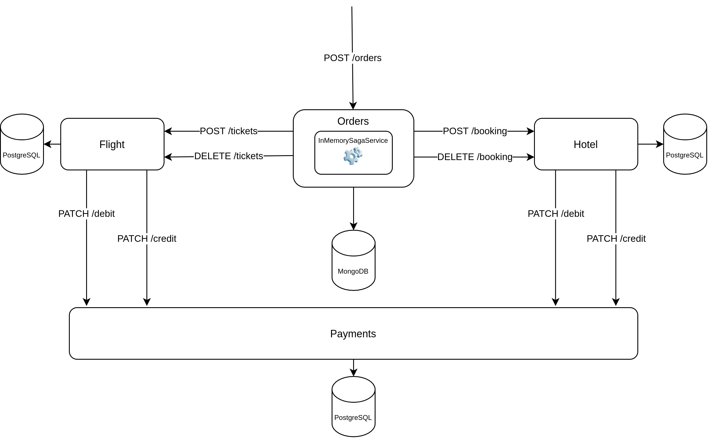

# Example of distributed transaction using Java 11 and [Apache Camel Saga Component](https://camel.apache.org/components/latest/saga-component.html).

### How it works



### Some components used in this example are:
* [Apache Camel](https://camel.apache.org/)
* [Spring Boot](https://spring.io/projects/spring-boot)
* [Spring WebFlux](https://docs.spring.io/spring-framework/docs/current/reference/html/web-reactive.html#webflux)
* [Spring Data MongoDB](https://spring.io/projects/spring-data-mongodb)
* [OkHttp](https://square.github.io/okhttp/)
* [WireMock](http://wiremock.org/)
* [Testcontainers](https://www.testcontainers.org/)
* [REST-assured](https://rest-assured.io/)
* [Spring Data R2DBC](https://spring.io/projects/spring-data-r2dbc)
* [MongoDB](https://www.mongodb.com/)
* [PostgreSQL](https://www.postgresql.org/)
* [H2 Database Engine](https://www.h2database.com/)
* [Docker Compose](https://docs.docker.com/compose/)

#### Running the application
The startup.sh script can be used to build and start the application.
```shell
./startup.sh
```